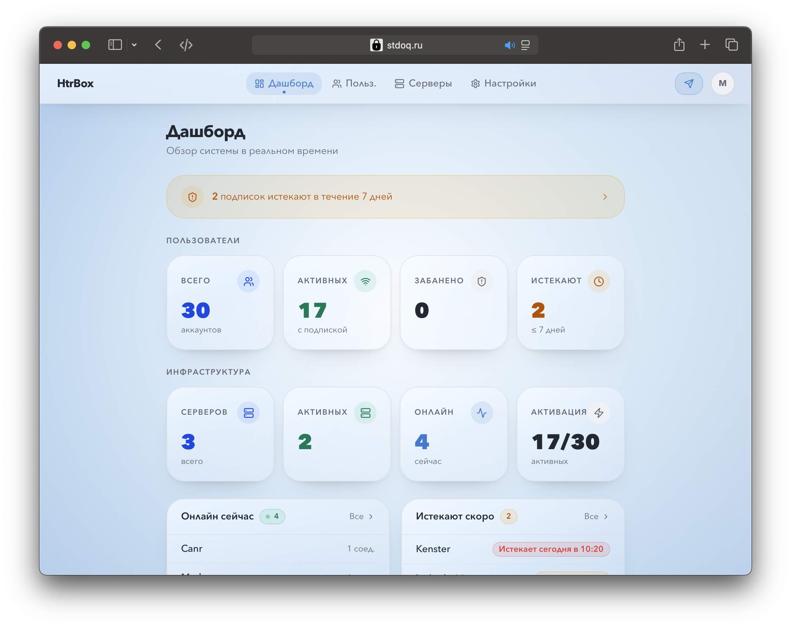
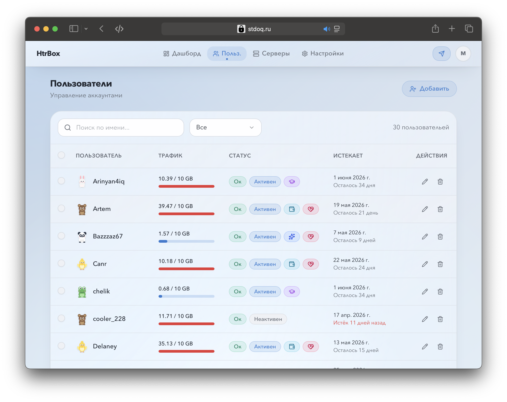
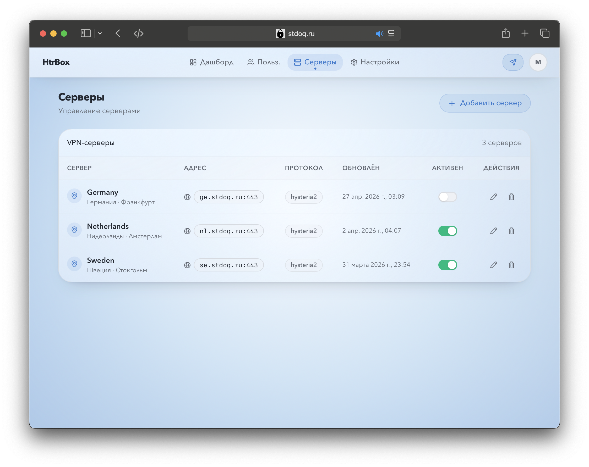
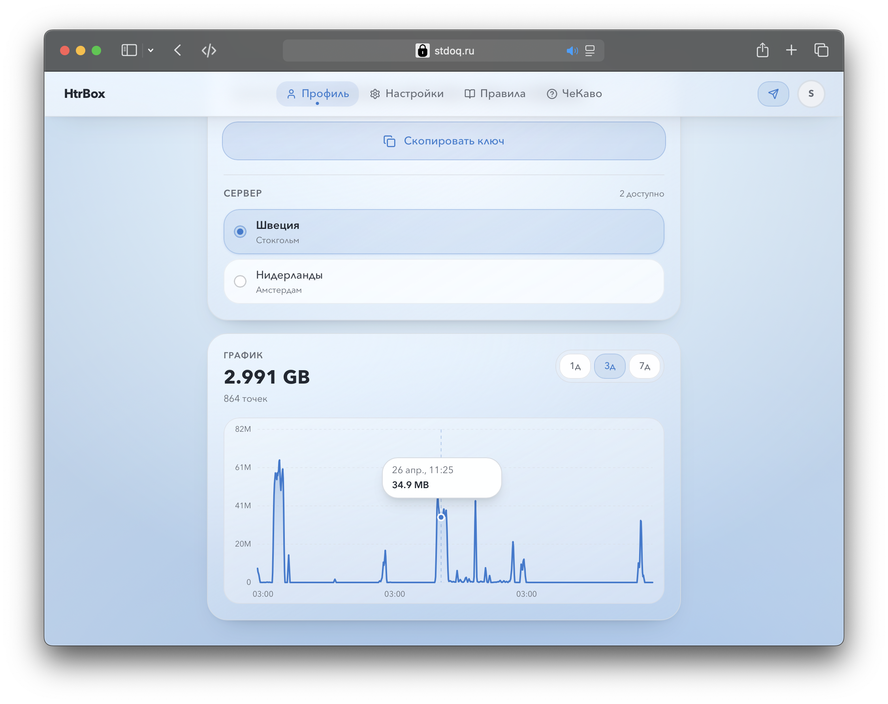
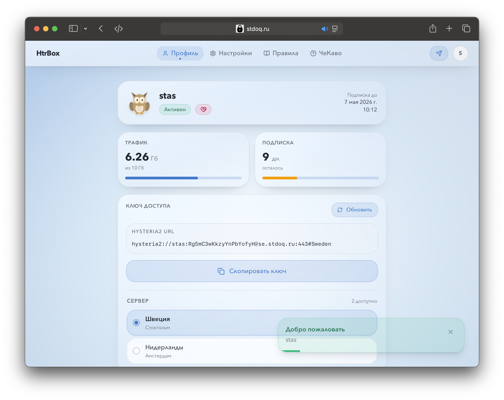
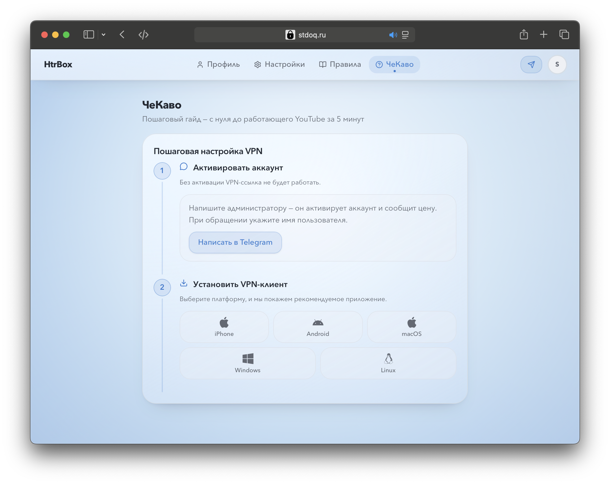
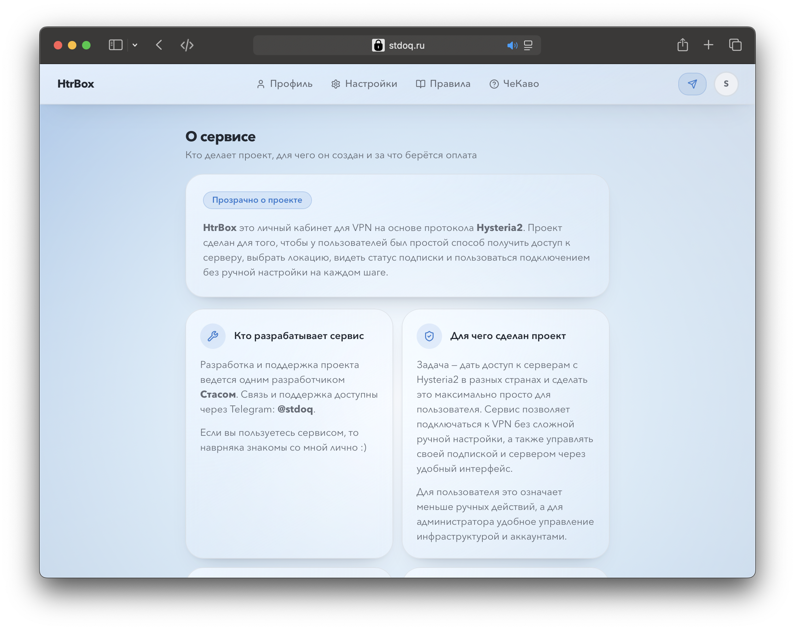
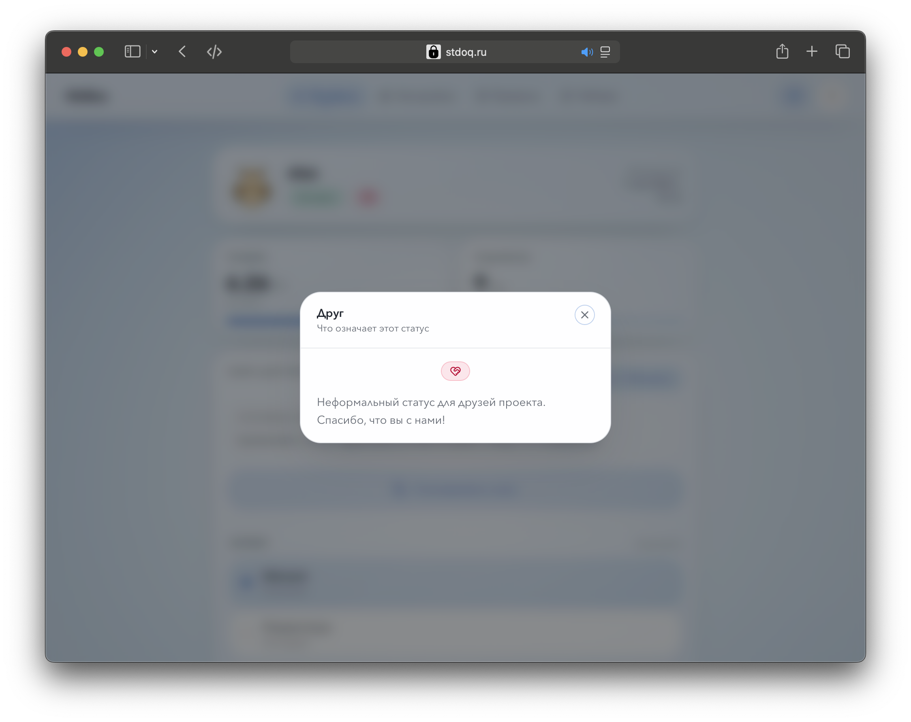

# HtrBox

Production-oriented Hysteria 2 VPN management platform with a FastAPI backend,
a React admin/user interface, PostgreSQL persistence, traffic accounting, and
Ansible-based deployment automation.



## Overview

HtrBox provides a web control plane for operating Hysteria 2 VPN access across
one or more servers. It includes account management, role-based access,
connection URL generation, server lifecycle controls, traffic aggregation, and
background maintenance jobs.

The repository contains everything needed for local development and deployment:

- `backend` - FastAPI API, authentication, database access, Hysteria integration,
  traffic collection, maintenance workers, and rate limiting.
- `frontend` - React 19, Vite, TypeScript application for administrators and
  end users.
- `hysteria` - local Hysteria 2 configuration used by Docker Compose.
- `ansible` - deployment playbooks and templates for the main application host
  and regional Hysteria nodes.
- `.github/workflows` - GitHub Actions workflow for building images and running
  Ansible deployment.



## Features

- JWT access tokens with refresh tokens stored in `HttpOnly` cookies.
- Role-based access control for `admin` and `user` accounts.
- User registration, activation, blocking, password changes, and subscription
  status management.
- Hysteria user secret regeneration via `hyPassword`.
- Server inventory management: create, update, deactivate, and delete nodes.
- `hysteria2://` client URL generation.
- Admin dashboard with user, server, online, subscription, and traffic signals.
- User profile with account status, traffic usage, expiry data, selected server,
  and connection information.
- Traffic collection from the Hysteria management API with 5-minute buckets.
- Background maintenance for account state and traffic retention.
- Per-endpoint rate limiting and brute-force protection.
- Healthcheck endpoint and baseline security headers.
- GitHub Actions build pipeline with GHCR image publishing.
- Ansible deployment for the main application host and regional VPN servers.



## Tech Stack

```text
Backend       Frontend          Infrastructure
--------------------------------------------------------
Python 3.11   React 19          Docker / Docker Compose
FastAPI       TypeScript        Hysteria 2
PostgreSQL    Vite              GitHub Actions
psycopg2      TanStack Query    GitHub Container Registry
PyJWT         Zustand           Ansible
bcrypt        React Hook Form   Certbot + Cloudflare DNS
httpx         Zod
Uvicorn       Tailwind CSS v4
              Radix UI
              Recharts
              lucide-react
```



## Architecture

```text
Browser
  |
  | /api/*
  v
Frontend dev server / production nginx
  |
  | proxied API requests
  v
FastAPI backend
  |
  +--> PostgreSQL
  |
  +--> Hysteria 2 management API
  |
  +--> background traffic collector
  |
  +--> background maintenance worker
```

In local development, the Vite server proxies `/api/*` and `/api/ws` to the
backend through Docker service names configured in `frontend/vite.config.ts`.



## Repository Layout

```text
.
├── ansible/
│   ├── deploy.yml
│   ├── inventory.yml
│   └── templates/
├── backend/
│   ├── source/
│   │   ├── main.py
│   │   ├── config.py
│   │   ├── database.py
│   │   ├── routers/
│   │   └── ...
│   ├── Dockerfile
│   ├── requirements.txt
│   └── requirements-dev.txt
├── frontend/
│   ├── src/
│   │   ├── api/
│   │   ├── components/
│   │   ├── hooks/
│   │   ├── pages/
│   │   ├── stores/
│   │   └── styles/
│   ├── Dockerfile
│   ├── package.json
│   └── vite.config.ts
├── hysteria/
│   ├── certs/
│   └── config.yaml
├── docker-compose.yaml
└── README.md
```



## Quick Start

Docker Compose is the recommended local development path. It starts PostgreSQL,
the FastAPI backend, the Vite frontend, and a local Hysteria 2 server.

### 1. Create `.env`

Create a `.env` file in the repository root:

```env
ADMIN_USERNAME=admin
ADMIN_PASSWORD=change_me
JWT_SECRET=replace_with_a_long_random_secret_at_least_32_chars
HYSTERIA_AUTH=Bearer change_me

POSTGRES_USER=postgres
POSTGRES_PASSWORD=postgres
POSTGRES_DB=htrbox

ALLOWED_ORIGINS=http://localhost:5173
COOKIE_SECURE=false
COOKIE_SAMESITE=lax
DOCS_ENABLED=true
```

For a strong JWT secret, use:

```bash
openssl rand -hex 32
```

The backend validates required configuration at startup and fails fast if a
required value is missing or if `JWT_SECRET` is too short.

### 2. Configure local Hysteria

The local Compose stack expects these files to exist:

- `hysteria/.env`
- `hysteria/config.yaml`
- `hysteria/certs/server.crt`
- `hysteria/certs/server.key`

The repository already includes a development Hysteria configuration and local
certificates. Replace them for real deployments.

### 3. Start the stack

```bash
docker compose up --build
```

Services:

- Frontend: `http://localhost:5173`
- Backend API: `http://localhost:8000`
- Backend healthcheck: `http://localhost:8000/health`
- Swagger UI: `http://localhost:8000/docs` when `DOCS_ENABLED=true`
- PostgreSQL: `localhost:5432`
- Hysteria management API: `localhost:8080`



## Manual Development

Running everything through Compose is simpler because the frontend proxy points
to Docker service names. Manual startup is still useful when working on one
layer at a time.

### Backend

```bash
cd backend
python3 -m venv venv
source venv/bin/activate
pip install -r requirements.txt
cd source
uvicorn main:app --reload --host 0.0.0.0 --port 8000
```

### Frontend

```bash
cd frontend
npm ci
npm run dev
```

When running the frontend outside Docker, update the Vite proxy target from
`backend:8000` to `localhost:8000`, or keep the frontend in Compose.

### Frontend Build

```bash
cd frontend
npm run build
```

## Configuration

Configuration is loaded from environment variables in `backend/source/config.py`.

Required variables:

| Variable | Description |
| --- | --- |
| `ADMIN_USERNAME` | Initial administrator username, used for first-run seeding. |
| `ADMIN_PASSWORD` | Initial administrator password, used for first-run seeding. |
| `HYSTERIA_AUTH` | Authorization header value used for Hysteria API requests. |
| `JWT_SECRET` | Secret for signing JWT tokens. Must be at least 32 characters. |
| `POSTGRES_USER` | PostgreSQL username. |
| `POSTGRES_PASSWORD` | PostgreSQL password. |
| `POSTGRES_DB` | PostgreSQL database name. |

Important optional variables:

| Variable | Default | Description |
| --- | --- | --- |
| `POSTGRES_HOST` | `postgres` | PostgreSQL host. |
| `POSTGRES_PORT` | `5432` | PostgreSQL port. |
| `ALLOWED_ORIGINS` | `http://localhost:80` | Comma-separated CORS origins. |
| `COOKIE_SECURE` | `true` | Enables secure cookies and HSTS. Use `false` for local HTTP. |
| `COOKIE_SAMESITE` | `strict` | Cookie SameSite policy: `strict`, `lax`, or `none`. |
| `DOCS_ENABLED` | `false` | Enables `/docs`, `/redoc`, and `/openapi.json`. |
| `LOG_LEVEL` | `INFO` | Backend logging level. |
| `TRAFFIC_POLL_INTERVAL` | `30` | Seconds between Hysteria traffic polls. |
| `TRAFFIC_BUCKET_SECONDS` | `300` | Traffic aggregation bucket size. |
| `TRAFFIC_RETENTION_DAYS` | `7` | Retention for aggregated traffic rows. |
| `MAINTENANCE_INTERVAL` | `600` | Seconds between maintenance runs. |

Rate limiting is also configurable with `RT_*` variables. See
`backend/source/config.py` for the full list.

## Application Routes

### Administrator

- `/admin` - dashboard
- `/users` - user management
- `/servers` - server management
- `/settings` - account settings

### User

- `/profile` - account status, usage, server selection, and connection URL
- `/manual` - onboarding and usage guide
- `/chekavo` - additional user page
- `/settings` - account settings

### Public

- `/login`
- `/register`

## API Surface

Main API groups:

- `/auth` - login, refresh, logout, registration, and Hysteria auth callback.
- `/users` - admin user management and self-service user actions.
- `/servers` - VPN server inventory and lifecycle operations.
- `/traffic` - traffic metrics by user and server.
- `/kick` - disconnect a Hysteria user.
- `/online` - online Hysteria users.
- `/generate-url/{username}` - Hysteria connection URL generation.
- `/health` - public liveness/readiness probe.

The OpenAPI schema is available only when `DOCS_ENABLED=true`.

## Backend Startup Lifecycle

On startup, the backend:

1. Configures logging.
2. Validates required environment variables.
3. Initializes the PostgreSQL connection pool.
4. Creates missing database tables.
5. Seeds the first administrator account from `ADMIN_USERNAME` and
   `ADMIN_PASSWORD`.
6. Starts rate limiter cleanup.
7. Starts the traffic collector.
8. Starts the maintenance worker.

The application intentionally fails startup if critical background workers do
not start, because traffic accounting and account maintenance are part of the
core service contract.

## Security Notes

- Account passwords are hashed with bcrypt.
- Access tokens are kept in frontend memory.
- Refresh tokens are stored in `HttpOnly` cookies.
- Roles are read from the database on authenticated requests, so role changes
  take effect without waiting for the access token to expire.
- `COOKIE_SECURE=true` is recommended for production and enables HSTS headers.
- API documentation is disabled by default in production.
- Request bodies are globally capped at 1 MB.
- Sensitive endpoints are protected by per-endpoint rate limits.
- `hyPassword` is stored as a VPN credential required by the Hysteria protocol,
  not as an account login password. See `backend/source/database.py` for the
  design note.
- Never commit production secrets, real certificates, or private deployment
  credentials.

## Deployment

The repository includes a GitHub Actions workflow and Ansible playbook for
building and deploying the platform.

### GitHub Actions

`.github/workflows/deploy.yml` can:

1. Build backend and frontend Docker images.
2. Push images to GitHub Container Registry.
3. Run `ansible/deploy.yml` against the selected target.

Workflow inputs include:

- Deployment target: `all`, `yc`, `vps`, or a specific regional VPS target.
- Task tags: `prepare`, `certbot`, `deploy`, `status`, `logs`, or `healthcheck`.
- Build control: normal build or deployment from an existing image tag.

Required GitHub secrets:

| Secret | Purpose |
| --- | --- |
| `SSH_PRIVATE_KEY` | Shared SSH deployment key for application and VPN hosts. |
| `JWT_SECRET` | Production JWT signing secret. |
| `ADMIN_USERNAME` | Initial admin username. |
| `ADMIN_PASSWORD` | Initial admin password. |
| `POSTGRES_PASSWORD` | Production PostgreSQL password. |
| `HYSTERIA_AUTH` | Shared Hysteria management API authorization value. |
| `CF_API_TOKEN` | Cloudflare API token for DNS-based certificate issuance. |
| `EMAIL` | Email used for Certbot registration and renewal notices. |

### Ansible

The Ansible playbook renders environment files and Docker Compose files from
templates, checks Docker availability, manages certificates, pulls GHCR images,
starts containers, and performs health checks.

Useful commands for local operators:

```bash
ansible-playbook ansible/deploy.yml \
  -i ansible/inventory.yml \
  --private-key ~/.ssh/deploy_key \
  --tags deploy
```

Limit deployment to a specific group:

```bash
ansible-playbook ansible/deploy.yml \
  -i ansible/inventory.yml \
  --private-key ~/.ssh/deploy_key \
  --limit yc \
  --tags healthcheck
```

## Development Map

High-value directories when changing the application:

- `backend/source/routers` - HTTP endpoints.
- `backend/source/schemas.py` - API request and response models.
- `backend/source/database.py` - schema initialization and persistence helpers.
- `backend/source/traffic_collector.py` - traffic polling and aggregation.
- `backend/source/maintenance.py` - scheduled account and data maintenance.
- `frontend/src/pages` - route-level screens.
- `frontend/src/components` - reusable UI and domain components.
- `frontend/src/api` - frontend API clients.
- `frontend/src/hooks` - data fetching and application hooks.
- `frontend/src/stores` - Zustand stores.
- `frontend/src/styles` - tokens, shared variants, and CSS.

## Useful Commands

```bash
# Start the complete local stack
docker compose up --build

# Stop local containers
docker compose down

# Start backend manually
cd backend/source
uvicorn main:app --reload --host 0.0.0.0 --port 8000

# Start frontend manually
cd frontend
npm run dev

# Build frontend assets
cd frontend
npm run build
```



## First Run Checklist

1. Create `.env` with required variables.
2. Start the local stack with `docker compose up --build`.
3. Check `http://localhost:8000/health`.
4. Open `http://localhost:5173`.
5. Log in with the initial administrator account.
6. Add the first Hysteria server in `/servers`.
7. Create a test user.
8. Generate and test a Hysteria connection URL.
